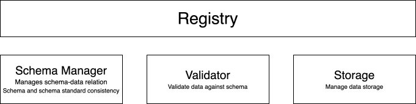

# Welcome to Sweet Validation

*Sweet Validation* is package to perform data validation within the [Sweet CoSi](https://www.sweet-cosi.ch/) project. To perform validation, the package relies on a description
of data tables using yaml or json files. Data items are checked against the description
provided in these files.

## Overview

Our approach relies on a Registry that manages the schemas and its relations to data.

The registry relies on three main components:

- *SchemaManager* stores schemas that are used to validate data. The manager keeps track
of the relation between schemas and data and also validates new schemas against the imposed
meta-data standard.
- *Validators* provide methods to validate data against a given schema.
- *FileStorage* provides the methods to persist and retrieve data.

Using validators, the registry coordinates the actions between the SchemaManager and
the FileStorage ensuring that no data are saved or updated without validation.

## Installation

**tbd**

<!-- To harmonize the description of data, *Sweet Validation* allows to set a standard
for the data description, i.e., imposing a meta-data standard. By default this
standard is set to the [Frictionless Table Scheme](https://specs.frictionlessdata.io//table-schema/). It is, however, possible to impose any standard as long as it is
a valid [json schema](https://json-schema.org/).

To validate data, we rely on a Validator class (ADD LINK TO API DOCS) that mainly provides two methods:

1. validate(data, schema): Takes a data item and a schema. Validating the data against
the schema, it provides a validation report.
2. is_valid(data, schema): Uses the validate method to return an indicator whether
the data item is valid or not.

The default Validator uses frictionless table schemas to validate [pandas dataframes](https://pandas.pydata.org/docs/index.html)
against the schema using the [pandera](https://pandera.readthedocs.io/en/stable/) package.

Validators check data against schemas. They however do not maintain the relation
between data and schema, i.e., which schema is bound to which data item. The
SchemaManager (ADD LINK TO API DOCS) has two major
tasks:

1. Managing the relation between data items and schema
2. Ensuring that all schemas comply with the meta-data standard.

The Registry (ADD LINK TO API DOCS) combines the
SchemaManager and Validator together with a Storage interface that is responsible
to save the data:

[Registry image](figures/sweet_registry.svg)

By interacting with schemas and data through the registry, it ensures that no data
exists without a schema. Furthermore, it ensure that every change in data is checked
against the associated schema. Likewise, every schema update triggers a validation
check for all associated data resources.
 -->
